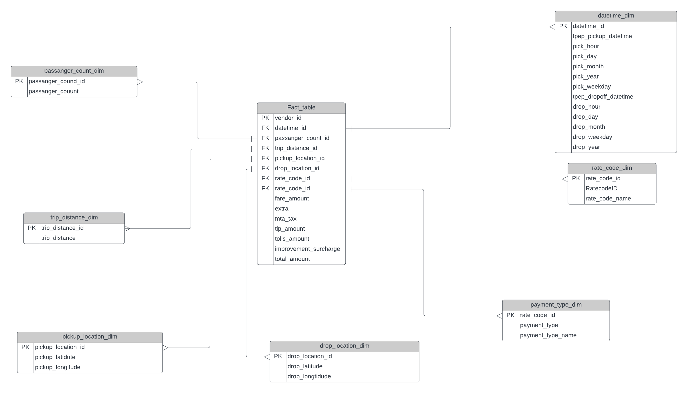

# Uber-Data-Analytics-Project

## Introduction

The goal of this project is to perform data analytics on Uber data using various tools and technologies, including GCP Storage, Python, Compute Instance, Mage Data Pipeline Tool, BigQuery, and Looker Studio.

## Architecture

## Technology Used

- Programming Language - Python
- Google Cloud Platform
  - Google Storage
  - Compute Instance
  - BigQuery
  - Looker Studio
- Modern Data Pipeline Tool - [Mage Data Pipeline Tool](https://www.mage.ai/)

## Dataset Used

The dataset used in this project is TLC Trip Record Data. It includes fields capturing pick-up and drop-off dates/times, pick-up and drop-off locations, trip distances, itemized fares, rate types, payment types, and driver-reported passenger counts.

Here is the dataset used in the project - [Dataset Link](https://example.com/dataset.csv)

More information about the dataset can be found here:
- [Dataset Website](https://www.example.com/dataset)
- [Data Dictionary](https://www.example.com/dictionary.pdf)
- [Data Model](https://www.example.com/datamodel.png)

## Model Diagram

